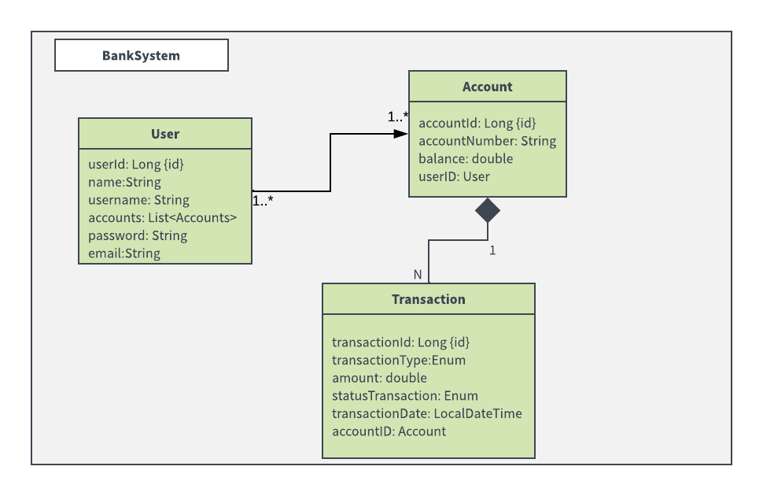

# Proyecto BankSystem

## Descripción del proyecto

Sistema bancario que se encargará de hacer gestión de usuarios, cuentas y transacciones entre cuentas, se describen las funcionalidades específicas a continuación:

- **Gestión de usuarios:** Creación, actualización, eliminación, autenticación, y autorización de usuarios.

- **Gestión de cuentas bancarias:** Creación y manejo de cuentas bancarias asociadas a los usuarios y consultas de saldo.

- **Operaciones bancarias:** Depósito de fondos en cuentas específicas, retiro de fondos con validación de fondos disponibles y trazabilidad de las transacciones.

- **Autenticación y autorización:** Implementación de Spring Security para el logueo, registro y autenticación de usuarios.

- **Test unitarios y de integración:** Generación de test unitarios relacionados a las funcionalidades más importantes

### Diagrama Entidad-Relación:

### Diagrama UML:

## Tecnologías usadas
- Java 17
- Spring Boot 3.0
- JPA/Hibernate
- JUnit y Mockito para test
- Gradle
- Lombok
- Base de datos H2
- Intellij IDEA Community Edition
- Swagger
- Spring Security

## Pruebas

### Pruebas unitarias:
Se le hacen pruebas a los servicios de User, Account y Transaction ya que son los que entregan las funcionalidades clave.

### Pruebas de integración:
Se hacen pruebas de integración a las funcionalidades de los servicios anteriormente mencionados y su interacción
con distintos componentes como el repositorio y la base de datos.

### API Test
Colección de Postman em formato JSON con las diferentes pruebas hechas a la API

## Organización por commits del proyecto

Esta sección del repositorio consiste en documentar los distintos commits a lo largo del tiempo del sistema bancario que al final deberá contar con funcionalidades tales como:

1. Creación inicial del README.md para la documentación técnica y de usuario que se irá actualizando a medida que se vayan agregando funcionalidades.
2. Creación de diagramas UML y ER.

3. Creación de modelos para las entidades de User, Account y Transaction con sus distintas relaciones
    - **Relaciones:** 
      - **OneToMany:** User -> Account
      - **ManyToOne:** Account -> User
      - **OneToMany:** Account -> Transaction

4. Implementación inicial de la arquitectura MVC con las 3 capas de repository, service y controller, además de la generación 
de las primeras funciones CRUD para los usuarios:
    - Crear Usuario
    - Obtener Usuario
    - Editar Usuario
    - Eliminar Usuario
    - Listar todos los usuarios

5. - Implementación de la lógica para gestión de cuentas bancarias creadas en función de un usuario en específico,
      se implementa patrón DTO para que la solicitud de creación de la cuenta bancaria sea mucho más escalable y segura.
      - Crear cuenta
      - Obtener Cuenta
      - Listar todas las cuentas
      - Editar cuenta
      - Eliminar cuenta
   - Se agrega la anotación @JsonIgnore en la entidad Account para que no se genere un loop a la hora de listar los usuarios y las cuentas.
   - Se agrega el enum TransactionType para delimitar los dos tipos de transacciones que tendremos
   - Se le da un mejor orden a las entidades ya creadas, se les agrega propiedades a ciertos campos para no aceptar nulos y que sean campos únicos.

6. - Implementación de la lógica CRUD para las transacciones de las cuentas en función de una cuenta específica, se usa el patrón DTO para manejar la solicitud
   de creación.
     - Crear transacción
     - Obtener transacción
     - Listar todas las transacciones
     - Listar transacción por accountId
   - Se crea un Enum para manejar los estados de la transacción: EXITOSO o DECLINADO
   - Se actualizan los diagramas UML y ER para incluir los cambios realizados
7. Creación de pruebas unitarias y de integración para la implementación de los servicios User, Account y Transaction usando el patron AAA y su interacción con las demás capas.
8. - Se agrega Swagger y ula carpeta de config para la documentación interactiva de la Api y se agrega el siguiente endpoint para su consulta: http://localhost:8080/swagger-ui.html
   - Se hacen unos cambios pequeños en la organización del README.md
9. Se agrega la colección de postman en formato JSON para el testeo de la API y los endponints de los distintos controllers.

